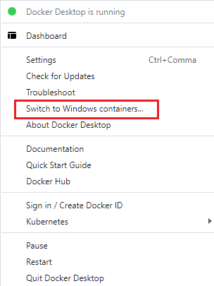

[](https://github.com/gillesvink/NukeDockerBuild/actions/workflows/create_dockerfiles.yaml) [](https://github.com/gillesvink/NukeDockerBuild/actions/workflows/build_linux.yaml) [](https://github.com/gillesvink/NukeDockerBuild/actions/workflows/build_windows.yaml) 


> Ready to use Docker images to build Nuke plugins for all operating systems (Mac, Linux, Windows).

--- 
The images produced here will include everything you need to build Nuke plugins. This includes the compiler for C++ ([gcc-toolsets](https://access.redhat.com/documentation/en-us/red_hat_developer_toolset/12) on Linux, [Visual Studio](https://visualstudio.microsoft.com/downloads/) on Windows, clang for MacOS using [OSXCross](https://github.com/tpoechtrager/osxcross)), [CMake](https://cmake.org/) and the Nuke files required to compile.

These images are meant for both local development using development containers as well as deployment using CI/CD.

## 🏷 Tags

You can pull from the GHCR (Github Package Registry) registry by using:

```bash
docker pull ghcr.io/gillesvink/nukedockerbuild:TAG
```

Where as tag will be the one you want to use. The table below will be updated automatically to show the available tags.

**Note**: a latest tag for each Nuke version is provided. Which will be in this format: `{nuke_version}-{os}-latest`. For example `15.0-linux-latest`. Or Linux and Mac also have slim packages available (massively reduced image size): `15.0-linux-slim-latest`.

You can also use the locked tag, which will be `15.0-linux-1.0` for example.

<!-- TABLE_START -->
| Tag                      | Locked Tag            | Upstream Image                                | Date Added   |   Image Size (GB) |
|:-------------------------|:----------------------|:----------------------------------------------|:-------------|------------------:|
| `15.0-linux-latest`      | `15.0-linux-1.0`      | rockylinux:8                                  | 2024-01-15   |             0.347 |
| `15.0-linux-slim-latest` | `15.0-linux-slim-1.0` | rockylinux:8                                  | 2024-01-15   |             0.198 |
| `15.0-windows-latest`    | `15.0-windows-1.0`    | mcr.microsoft.com/windows/servercore:ltsc2022 | 2024-01-15   |             5.491 |
| `14.1-linux-latest`      | `14.1-linux-1.0`      | centos:centos7.9.2009                         | 2024-01-15   |             0.379 |
| `14.1-linux-slim-latest` | `14.1-linux-slim-1.0` | centos:centos7.9.2009                         | 2024-01-15   |             0.172 |
| `14.1-windows-latest`    | `14.1-windows-1.0`    | mcr.microsoft.com/windows/servercore:ltsc2022 | 2024-01-15   |             4.561 |
| `14.0-linux-latest`      | `14.0-linux-1.0`      | centos:centos7.9.2009                         | 2024-01-15   |             0.379 |
| `14.0-linux-slim-latest` | `14.0-linux-slim-1.0` | centos:centos7.9.2009                         | 2024-01-15   |             0.171 |
| `14.0-windows-latest`    | `14.0-windows-1.0`    | mcr.microsoft.com/windows/servercore:ltsc2022 | 2024-01-15   |             4.556 |
| `13.2-linux-latest`      | `13.2-linux-1.0`      | centos:centos7.4.1708                         | 2024-01-15   |             0.338 |
| `13.2-linux-slim-latest` | `13.2-linux-slim-1.0` | centos:centos7.4.1708                         | 2024-01-15   |             0.145 |
| `13.2-windows-latest`    | `13.2-windows-1.0`    | mcr.microsoft.com/windows/servercore:ltsc2022 | 2024-01-15   |             3.277 |
| `13.1-linux-latest`      | `13.1-linux-1.0`      | centos:centos7.4.1708                         | 2024-01-15   |             0.338 |
| `13.1-linux-slim-latest` | `13.1-linux-slim-1.0` | centos:centos7.4.1708                         | 2024-01-15   |             0.145 |
| `13.1-windows-latest`    | `13.1-windows-1.0`    | mcr.microsoft.com/windows/servercore:ltsc2022 | 2024-01-15   |             3.276 |
| `13.0-linux-latest`      | `13.0-linux-1.0`      | centos:centos7.4.1708                         | 2024-01-14   |             0.398 |
| `13.0-linux-slim-latest` | `13.0-linux-slim-1.0` | centos:centos7.4.1708                         | 2024-01-14   |             0.146 |
| `13.0-windows-latest`    | `13.0-windows-1.0`    | mcr.microsoft.com/windows/servercore:ltsc2022 | 2024-01-14   |             3.276 |
<!-- TABLE_END -->


## 🔨 Issues 
If you might be running into issues using these Docker images: please feel free to make an [issue](https://github.com/gillesvink/NukeVersionParser/issues) on this repository.

## ⬆️ How is this updated? 
Since Nuke requires every minor release to be compiled natively, it needs to have a docker image as well for each minor version.

This is done in an automatic process to create the Dockerfiles whenever there is a new Nuke minor release. It uses the minor supported releases JSON from my other repo: [NukeVersionParser](https://github.com/gillesvink/NukeVersionParser).

This data is used once a day to check if there is anything new, and if there is anything new, a new Docker image will be build using the CI/CD process.

## 📝 Quickstart 
First of all make sure you have Docker installed on your system. Guides can be found here at [Docker Install](https://docs.docker.com/engine/install/).
Once installed, you can test the docker image by running the command provided here. There might be some warnings of deprecation, that is because some of the source code in the examples uses deprecated functions.

### Windows docker requirements
Windows has some additional requirements to run this image. You need to have at least Windows 10 Pro or greater. Besides that, you need to 'switch to Windows containers' in the Docker Desktop application.



Else it will use the Windows Subsystem for Linux (which is basically a virtualization of the Linux system, allowing you to even build Linux plugins on Windows.)

### Run tests locally
Beneath here are some quick tests to verify everything is working on your system. It should pass compiling (this is a test for a Nuke 15 image). It might take a while for the image to be downloaded
depending on your local internet connection.

#### Linux:
```bash
docker run --rm ghcr.io/gillesvink/nukedockerbuild:15.0-linux-slim-latest bash -c "cd /usr/local/nuke_install/tests && cmake . -B build && cmake --build build
```

#### Windows:
##### Powershell
```bash
docker run --rm `
    ghcr.io/gillesvink/nukedockerbuild:13.0-windows-latest `
    powershell -Command "cd C:\nuke_install\tests ; `
    cmake . -DCMAKE_GENERATOR_PLATFORM=x64 -B build ; `
    cmake --build build --config Release"
```
##### CMD (Command Prompt)
```bash
docker run --rm ^
    ghcr.io/gillesvink/nukedockerbuild:15.0-windows-latest ^
    powershell -Command "cd C:\nuke_install\tests ; ^
    cmake . -DCMAKE_GENERATOR_PLATFORM=x64 -B build ; ^
    cmake --build build --config Release"
```

### Building the current directory (that contains a CMakeLists file)
Note that you can change it to whatever Nuke version is available. In this example Nuke 15 is used.
#### Linux:
```bash
docker run --rm -v "$(pwd):/nuke_build_directory \
    ghcr.io/gillesvink/nukedockerbuild:15.0-linux-slim-latest bash -c \
    "cmake . -B build && cmake --build build
```
#### Windows:
On Windows it is important that `--isolution=process` is set as it is mounting the directory, else there will be issues with cleaning files in the mounted directory. Also for CMake building it requires the config to be specified for release using `--config Release`.
##### Powershell
```bash
docker run --rm --isolation=process `
    -v ${PWD}:C:\nuke_build_directory `
    ghcr.io/gillesvink/nukedockerbuild:15.0-windows-latest powershell -Command `
    "cmake . -DCMAKE_GENERATOR_PLATFORM=x64 -B build ; `
    cmake --build build --config Release"
```
##### CMD (Command Prompt)
```bash
docker run --rm --isolation=process ^
    -v %CD%:C:\nuke_build_directory ^
    ghcr.io/gillesvink/nukedockerbuild:15.0-windows-latest powershell -Command ^
    "cmake . -DCMAKE_GENERATOR_PLATFORM=x64 -B build ; ^
    cmake --build build --config Release"
```

## 📦 Image size
This depends on the image you choose to use. Windows itself has quite large images, because it is relying on the server core image. Besides that the build tools are also quite big. As a result of that the Windows images are around 9gb.

Linux however can be optimized a lot more. The base system is around 400 MB compressed and 1.2 GB uncompressed. However here are also slim images available. These are around only 150 MB compressed, 400 MB uncompressed (while only a Nuke install would already be around 10gb). Note that these slim images only provide functionality to compile plugins. The rest of the system is basically gone. If you plan to extend these images please choose the usual image, and not the slim version.

### Slim
These images only include everything that is absolutely necessary for compiling purposes, the rest is erased. If [SlimToolkit](https://slimtoolkit.org/) will support Windows eventually, Slim images are then planned to be available as well for Windows.

## ⚙️ Technical info
The images depend on the specs provided by the [NDK documentation](https://learn.foundry.com/nuke/developers/13.2/ndkdevguide/intro/pluginbuildinginstallation.html) and the [VFX reference platform](https://vfxplatform.com/).

If you like to see how images are made, feel free to look at the dockerfiles in the [dockerfiles directory](dockerfiles). They are all grouped under their respective Nuke version as the target OS. Also all builds are public in the Github Actions CI process.

Nuke will always be installed at `/usr/local/nuke_install` on Linux and `C:\nuke_install` on Windows. The entry directory if you execute this image will be `/nuke_build_directory` on Linux and `C:\nuke_build_directory` on Windows.

The image also has the `NUKE_VERSION` environment set, this will always contain the version that is available in the image. For example `15.0`

### Linux
All Linux images are based on Red Hat based images. This means [Rocky Linux](https://hub.docker.com/_/rockylinux) for Nuke 15+ and [CentOS](https://hub.docker.com/_/centos) for anything lower than 15. As [Foundry is using Rocky](https://learn.foundry.com/nuke/content/release_notes/15.0/nuke_15.0v1_releasenotes.html), I choose to stick to that as well. However it is basically identical to Alma.

### Windows
For Windows the [Server Core ltsc2022](https://hub.docker.com/_/microsoft-windows-servercore) image is used. Besides that, for package installation the [Chocolatey package registry](https://community.chocolatey.org/packages) is used to install both the VS Build Tools as well as CMake.

### MacOS
The MacOS packages actually run on [Debian Bookworm](https://hub.docker.com/_/debian). It uses [OSXCross](https://github.com/tpoechtrager/osxcross) for cross compiling. Both `arm64` and `amd64` images are made, to support both Intel cpu's and M1, M2, etc.

All images are built on Apple hardware and should only be used on Apple hardware.

#### [Please ensure you have read and understood the Xcode license terms before continuing.](https://www.apple.com/legal/sla/docs/xcode.pdf)

To set this up correctly, you also need to use the appropriate toolchain for CMake. You can get started quickly by using my template from [NukePluginTemplate](https://github.com/gillesvink/NukePluginTemplate). The toolchain can be found locally at `/nukedockerbuild/toolchain.cmake` and should be set when using CMake. If you prefer to use your own CMake, make sure to setup the project using `-DCMAKE_TOOLCHAIN_FILE=$GLOBAL_TOOLCHAIN` set.


## ❤️ Thanks
Thanks to everyone who contributed anything to the images that are used in these dockerfiles and to the maintainers of all plugins used! Without all the open source code applications that are available this would never have been possible.

## ⚠️ Disclaimer
This project is an independent effort, not affiliated with or endorsed by Foundry. 
It provides Docker images for plugin building purposes. 
The terms "Nuke" and related trademarks are the property of Foundry, 
used here for descriptive purposes only. For official information and support, 
please refer to Foundry's [official website](https://www.foundry.com/).

By using this project, you agree on the [EULA](https://www.foundry.com/eula) provided by Foundry.